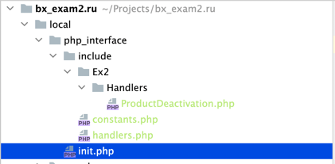

# Готовый экзамен Битрикс «№2 Основные технологии, расширение типовых возможностей системы» (Версия 4.0.4, 27.02.2019)

* [Задания и решения](./wiki/tasks/tasks.md)

***
### Основные моменты, которые необходимо сделать перед решением билета
1. Создать папку в корне сайта `/local`
2. Скопировать шаблон сайта `furniture_pale-blue` в `/local/templates`
3. Открыть `header.php`
4. Добавить константу `LANGUAGE_ID` в тег `html` аттрибут `lang`
5. Реализовать удобство подключения дополнительных скриптов в `/local/php_interface`
   1. Создать папку `php_interface`
   2. Создать файл `init.php` в папке `php_interface`
   3. Создать папку `inсlude` в папке `php_interface`. В этой папке будут все доп. скрипты
   4. В эту папку добавить файлы `constants.php`(Будут лежать константы) и `handlers.php`(Будет лежать код подключения событий)
   5. Создать папку `Ex2` в ней будут лежать классы и их методы
   6. Подключить все это дело в `init.php` 
```php 
    if(!defined("B_PROLOG_INCLUDED") || B_PROLOG_INCLUDED!==true) die();
    use \Bitrix\Main\Loader;
    
    \CModule::AddAutoloadClasses(
        '',
        array(
        'Ex2\Debug' => "lib/debug.php",
        'Ex2\Handlers\ProductDeactivation' => "include/Ex2/Handlers/ProductDeactivation.php",
        )
    );
    
    if (file_exists($_SERVER["DOCUMENT_ROOT"]."/local/php_interface/include/constants.php"))
    require_once($_SERVER["DOCUMENT_ROOT"]."/local/php_interface/include/constants.php");
    
    if (file_exists($_SERVER["DOCUMENT_ROOT"]."/local/php_interface/include/handlers.php"))
    require_once($_SERVER["DOCUMENT_ROOT"]."/local/php_interface/include/handlers.php");
```
6. Структура при этом выглядит так
 
7. Пример подключения событий в файле 
```php
use \Bitrix\Main\Localization\Loc;
Loc::LoadMessages(__FILE__);
  
$eventManager = \Bitrix\Main\EventManager::getInstance();
$eventManager->addEventHandler('iblock', 'OnBeforeIBlockElementUpdate', array('Ex2\Handlers\ProductDeactivation', 'OnBeforeIBlockElementUpdateHandler'));

```


### Проверка отправки писем

* Запись в таблице "b_event" в БД (Настройки > Производительность > Таблицы)
* В каталоге очереди исходящей почты, в зависимости от окружения и настроек:
    * Новый demo-сервер на CentOS 7: каталог /home/bitrix/mail/ или /mailbox/ на рабочем столе
    * OSPanel: /OSPanel/userdata/temp/email/
    * Linux: /var/spool/mqueue/
* Выполнить "Проверка системы" (Настройки > Инструменты > Проверка системы), проверить параметр "Отправка почты" (Дополнительные функции)

Если данный репозиторий помог Вам в подготовке к сдаче экзамена, поставьте звездочку! :thumbsup:
