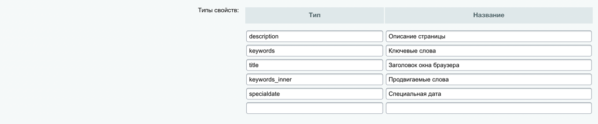

# [ex2-34] становить значение тега meta «specialdate» в компоненте news.list

*Подробное описание задачи смотреть в материалах: [примеры заданий (pdf)](../pubinfo/Ex2AllType.pdf)*

## Общие требования

* Расширить возможности типового компонента news.list. Компонент расположен по адресу /news/ и выводит информацию из инфоблока Новости.
* Создание нового компонента или подмена стандартного через local будет неверным решением, компонент должен остаться типовой. Нужно воспользоваться расширением его возможностей с помощью специальных файлов шаблона.
* Алгоритм решения, при котором будет использоваться некэшируемое обращение к базе данных - не будет верным.

## Решаемая задача

* В шаблон сайта, в файле header.php добавить тег ```<meta property="specialdate" content="">```, перед тегом title. Управление значением content для разделов сайта и статичных страниц должно быть доступно администратору сайта.

* Для всех страниц сайта по умолчанию значение тега установить равным «100».

* В настройки компонентов news и news.list добавить параметр в виде чек-бокса: «Установить свойство страницы specialdate». Значение параметра передавать из настроек комплексного компонента news в news.list на соответствующей странице комплексного компонента.

* Если параметр компонента «Установить свойство страницы specialdate» активен, то:
    * Определить дату новости, отображаемой первой на текущей странице
    * Полученный результат установить как значение тега

## Решение
1. Управление значениями метаданных через визуальный интерфейс, для этого необходимо создать соответствующие свойства в настройках модуля Управление структурой (Настройки > Настройки продукта > Настройки модулей >Управление структурой)
   

2. В шаблон сайта, в файле header.php добавить код  
   `<?$APPLICATION->ShowProperty("specialdate")?>` в теге `<head>`. Управление значением content для разделов сайта и статичных страниц должно быть доступно администратору сайта. И заполняться через панель разработчика.  
   Наполнение, через интерфейс для всего сайта по-умолчанию:
   

3. Перейти по пути `local/templates/furniture_pale-blue/components/bitrix/news/.default/` и создать файл `.parameters.php` в файле добавить параметр `SPECIAL_DATE`

```php
$arTemplateParameters = array(
	"SPECIAL_DATE" => Array(
		"NAME" => GetMessage("T_IBLOCK_DESC_SPECIAL_DATE"),
		"TYPE" => "CHECKBOX",
		"DEFAULT" => "Y",
	),
);
```
Не забываем про LANG-файлы. Так как экзамен все выносим в них.

4. Обновляем, через визуальный редактор компонент. И заполняем параметр к странице
   
5. Добавляем передачу параметра в news.list
```php
 $APPLICATION->IncludeComponent(
	"bitrix:news.list",
	"",
	Array(
        "SPECIAL_DATE" => $arParams["SPECIAL_DATE"],
    ...
    ),
  );
```
6. Создаем файл `result_modifier.php` в шаблоне компонента news.list  
   И размещаем код, что ниже
```php
if(!defined("B_PROLOG_INCLUDED") || B_PROLOG_INCLUDED!==true)die();
/** @var array $arParams */
/** @var array $arResult */
/** @global CMain $APPLICATION */
/** @global CUser $USER */
/** @global CDatabase $DB */
/** @var CBitrixComponentTemplate $this */
/** @var string $templateName */
/** @var string $templateFile */
/** @var string $templateFolder */
/** @var string $componentPath */
/** @var CBitrixComponent $component */
/** @var object $cp */

global $APPLICATION;

$cp = $this->__component;
$metaSpecDate = current($arResult['ITEMS'])["ACTIVE_FROM"];
if (is_object($cp) && !empty($metaSpecDate)){
    $cp->arResult['META_SPECIAL_DATE'] = $metaSpecDate;
    $cp->SetResultCacheKeys(array('META_SPECIAL_DATE'));
}
```
7. Создаем файл `component_epilog.php`  в шаблоне компонента news.list  
   И размещаем код, что ниже
```php
if(!defined("B_PROLOG_INCLUDED") || B_PROLOG_INCLUDED!==true)die();
/** @var array $arResult */
/** @global CMain $APPLICATION */

global $APPLICATION;

if(!empty( $arResult['META_SPECIAL_DATE'])){
    $APPLICATION->SetPageProperty('specialdate', $arResult['META_SPECIAL_DATE']);
}
```
**УРА! ПРОВЕРЯЕМ РАБОТУ)**
***
## Полезные ссылки

* [CMain::ShowProperty](https://dev.1c-bitrix.ru/api_help/main/reference/cmain/showproperty.php)
* [CMain::SetPageProperty](https://dev.1c-bitrix.ru/api_help/main/reference/cmain/setpageproperty.php)
* [CBitrixComponent::setResultCacheKeys](https://dev.1c-bitrix.ru/api_help/main/reference/cbitrixcomponent/setresultcachekeys.php)
* [GetMessage](https://dev.1c-bitrix.ru/api_help/main/functions/localization/getmessage.php)

____
* [Задания](tasks.md)
* [README.md](../../README.md)