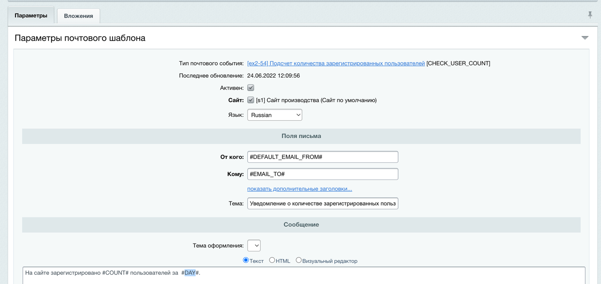

# [ex2-54] Подсчет количества зарегистрированных пользователей

*Подробное описание задачи смотреть в материалах: [примеры заданий (pdf)](../pubinfo/Ex2AllType.pdf)*

## Решаемая задача

* Создать функцию, которая будет подсчитывать, сколько новых пользователей зарегистрировано на сайте с момента прошлого подсчета и отправлять письмо всем пользователям из группы «Администраторы».

* Текст письма: «на сайте зарегистрировано [count] пользователей за [days]». Где count – количество зарегистрированных пользователей, days – за какое количество дней произведен подсчет.

* Шаблон текста письма должен быть доступен для редактирования администратору сайта.

* Функцию необходимо реализовать, используя технологию агентов, она должна запускаться 1 раз каждый день, в 01:00.

* Дату подсчета сохранять и получать с помощью параметров модулей.

* Почтовый сервер складывает письма в папку /home/bitrix/mail, можно проверить решение.

* Функцию назвать CheckUserCount, агента – Подсчет пользователей.

## Решение

* Создаём почтовое событие и шаблон  
 
* Создаем функцию `CheckUserCount()` в файле `local/php_interface/include/agents.php`, подключаем через init.php
```php
if (file_exists($_SERVER["DOCUMENT_ROOT"]."/local/php_interface/include/agents.php"))
    require_once($_SERVER["DOCUMENT_ROOT"]."/local/php_interface/include/agents.php");
```
* Дату подсчета сохранять и получать с помощью параметров модулей
```php
 // Дату подсчета сохранять и получать с помощью параметров модулей
    $sLastDate = COption::GetOptionString("main", "last_date_agent_checkUserCount");
    COption::SetOptionString("main", "last_date_agent_checkUserCount", $sDateNow);
```
* Описание логики внутри функции
```php
/**
 * [ex2-54] Подсчет количества зарегистрированных пользователей
 * @return string
 */
function CheckUserCount()
{
    // Текущая дата и время, вид: 06.12.2019 10:10:10
    $sDateNow = ConvertTimeStamp(time(), "FULL");

    // Дату подсчета сохранять и получать с помощью параметров модулей
    $sLastDate = COption::GetOptionString("main", "last_date_agent_checkUserCount");

    // Формируем фильтр по дате
    if (!empty($sLastDate)) {
        $arFilter = ["DATE_REGISTER_1" => $sLastDate];
    } else {
        $arFilter = [];
    }

    // Получаем отфильтрованных пользователей, отсортированных по дате регистрации
    $rsUsers = CUser::GetList($by = "DATE_REGISTER", $order = "ASC", $arFilter);
    $arUsers = [];
    while ($arUser = $rsUsers->Fetch()) {
        $arUsers[] = $arUser;
    }

    // Количество зарегистрированных пользователей за период времени
    $iCountUsers = count($arUsers);

    // Если подсчет производился впервые, получаем самую раннюю дату регистрации
    if (empty($sLastDate)) {
        $sLastDate = $arUsers[0]["DATE_REGISTER"];
    }

    // За какое количество дней произведен подсчет
    $iDifference = intval(strtotime($sDateNow) - strtotime($sLastDate));
    $iDays = round($iDifference / (3600 * 24));

    // Отправляем письмо всем пользователям из группы "Администраторы"
    $rsAdmins = CUser::GetList($by = "ID", $order = "ASC", ["GROUPS_ID" => 1]);
    while ($admin = $rsAdmins->Fetch()) {
        CEvent::Send(
            "CHECK_USER_COUNT",
            SITE_ID,
            [
                "EMAIL_TO"    => $admin["EMAIL"],
                // Количество зарегистрированных пользователей за период времени
                "COUNT" => $iCountUsers,
                // За какое количество дней произведен подсчет
                "DAY"  => $iDays,
            ],
            "N",
            "30"
        );
    }

    // Дату подсчета сохранять и получать с помощью параметров модулей
    COption::SetOptionString("main", "last_date_agent_checkUserCount", $sDateNow);

    return "CheckUserCount();";
}
```
* Создаем агента для вызова данной функции с параметрами:
    * Дата и время следующего запуска: 10.12.2019 01:00:00
    * Функция агента: CheckUserCount();
    * Периодичность выполнения: через заданный интервал
    * Интервал (сек.): 86400 (24 часа)

**УРА! ПРОВЕРЯЕМ РАБОТУ)**

## Важно! 
**В документации по CUser::GetList, не описана работа поля "DATE_REGISTER" в фильтре:**  
* В сортировке указываем "DATE_REGISTER"
* В фильтре, для нашей задачи "DATE_REGISTER_1":
    * DATE_REGISTER_1 - с какой даты регистрации пользователя
    * DATE_REGISTER_2 - по какую дату регистрации пользователя
    * Фильтрация идёт по дням "10.12.2019", без учета минут и секунд, их откидывает

***
## P.S.

* Иван Малышин "не будет никого на сайте и ок, cron не используем в этом задании"
    * [Экзамен №2. Вопросы и ответы по заданиям](https://dev.1c-bitrix.ru/support/forum/forum6/topic91539/?PAGEN_1=2)
* Иван Малышин "Нет хитов, ну значит не отработает. В рамках экзамена с выносом на крон - не заморачиваемся."
    * [Экзамен №2. Вопросы и ответы по заданиям](https://dev.1c-bitrix.ru/community/forums/forum6/topic91539/?PAGEN_1=8)

## Полезные ссылки

* [ConvertTimeStamp](https://dev.1c-bitrix.ru/api_help/main/functions/date/converttimestamp.php)
* [COption::GetOptionString](https://dev.1c-bitrix.ru/api_help/main/reference/coption/getoptionstring.php)
* [COption::SetOptionString](https://dev.1c-bitrix.ru/api_help/main/reference/coption/setoptionstring.php)
* [CUser::GetList](https://dev.1c-bitrix.ru/api_help/main/reference/cuser/getlist.php)
* [CEvent::Send](https://dev.1c-bitrix.ru/api_help/main/reference/cevent/send.php)

____
* [Задания](tasks.md)
* [README.md](../../README.md)