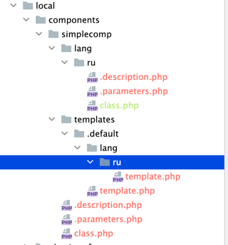
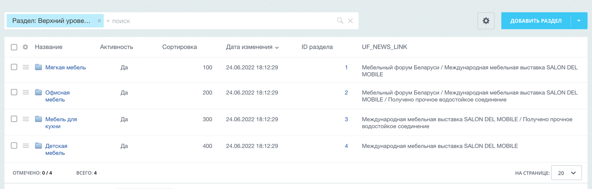

# [ex2-70] Разработать простой компонент «Каталог товаров»

*Подробное описание задачи смотреть в материалах: [примеры заданий (pdf)](../pubinfo/Ex2AllType.pdf)*

## Общие требования

* У созданного компонента задать код: simplecomp.exam, название: «Мой компонент», раздел для отображения компонента в визуальном редакторе: «Экзамен №2».

* Работу решения продемонстрировать в разделе сайта /ex2/simplecomp/, добавить пункт в главное меню «Экзамен2», и пункт в левом меню «Простой компонент».

## Решаемая задача

* Компонент должен выводить список товаров, сгруппированных по альтернативному классификатору. Альтернативный классификатор – новости.

* Будет использоваться множественная привязка разделов каталога товаров к альтернативному классификатору – новостям. Привязка элементов к разделам в инфоблоке Продукция остается по умолчанию, задавать множественную - не нужно.

* Используется только один уровень разделов, вложенности – не будет.

* Большой объем разделов и элементов не предполагается (не более 20 разделов и 100 элементов), лимиты на выборку и постраничная навигация – не нужны.

## Решение

**Для ускорения процесса можно скопировать любой системный компонент Битрикс, в результате вы получите всю необходимую структуру компонента, которую потом сможете отредактировать в соответствии с условиями задания.**

1) Подготавливаем "заготовку" для компонента:   
  1.1) Берём за основу системный компонент `\bitrix\components\bitrix\photo.random\`, копируем его в `\local\components\simplecomp\`

   1.2) Удаляем лишние файлы и папки из компонента:
   * `local/components/simplecomp/images`
   * `local/components/simplecomp/lang/en`
   * `component.php` - вместо него, мы будем использовать файл `class.php` (можно взять из `bitrix/components/bitrix/app.placement/class.php`)
   * и т.д.  

   
   1.3) Правим описание компонента `.description.php`
   * Изменяем параметры:
   * Удаляем иконку, в новых версиях компонентов они не используются - `"ICON" => "/images/photo_view.gif"`
   * Правим раздел для отображения компонента в визуальном редакторе: "ID" и "NAME"
   * `/lang/ru/.description.php`
   ```php
   <?
   if (!defined("B_PROLOG_INCLUDED") || B_PROLOG_INCLUDED !== true) {
       die();
   }
   
   $arComponentDescription = [
       "NAME"        => GetMessage("EX2_70_NAME"),
       "DESCRIPTION" => GetMessage("EX2_70_NAME"),
       "CACHE_PATH"  => "Y",
       "SORT"        => 1,
       "PATH"        => [
           "ID"   => "exam2",
           "NAME" => GetMessage("EX2_70_PATH_NAME"),
       ],
   ];  
   ```
    1.4) Правим параметры компонента - `.parameters.php`  
        * Удаляем лишнее, оставляем только `$arComponentParameters`  
        * Правим параметры:  
            * `BASE` - Базовые параметры для работы компонента  
        * `/lang/ru/.parameters.php`  

   ```php
   if (!defined("B_PROLOG_INCLUDED") || B_PROLOG_INCLUDED!==true) die();
   
   $arComponentParameters = array(
       "GROUPS" => array(),
       "PARAMETERS" => array(
           "IBLOCK_ID_CATALOG" => array(
               "PARENT" => "BASE",
               "NAME" => GetMessage("IBLOCK_ID_CATALOG"),
               "TYPE" => "STRING",
               "DEFAULT" => '',
           ),
           "IBLOCK_ID_NEWS" => array(
               "PARENT" => "BASE",
               "NAME" => GetMessage("IBLOCK_ID_NEWS"),
               "TYPE" => "STRING",
               "DEFAULT" => '',
           ),
           "CODE_UF_PROP" => array(
               "PARENT" => "BASE",
               "NAME" => GetMessage("CODE_UF_PROP"),
               "TYPE" => "STRING",
               "DEFAULT" => '',
           ),
           "CACHE_TIME"  =>  Array("DEFAULT"=>180),
           "CACHE_GROUPS" => array(
               "PARENT" => "CACHE_SETTINGS",
               "NAME" => GetMessage("CP_BPR_CACHE_GROUPS"),
               "TYPE" => "CHECKBOX",
               "DEFAULT" => "Y",
           ),
       ),
   );
   ```

   1.5) `class.php`
   * Для ускорения берём готовый файл, чтобы меньше писать, например, из `/bitrix/components/bitrix/app.placement/class.php`, который в себе уже содержит все основные методы и структуру.
   * public function onPrepareComponentParams($arParams)
   * public function executeComponent()

```php
if(!defined("B_PROLOG_INCLUDED") || B_PROLOG_INCLUDED !== true)
{
	die();
}

/**
 * Bitrix vars
 *
 * @var array $arParams
 * @var array $arResult
 * @var CBitrixComponent $this
 * @global CMain $APPLICATION
 */

use Bitrix\Main\Loader;

class CAPConnectComponent extends \CBitrixComponent
{
	public function onPrepareComponentParams($arParams)
	{
            // Приводим значения к числу
            $arParams["IBLOCK_CATALOG_ID"] = (int)$arParams["IBLOCK_ID_CATALOG"];
            $arParams["IBLOCK_NEWS_ID"] = (int)$arParams["IBLOCK_ID_NEWS"];
            $arParams['CODE_UF_PROP'] = trim($arParams['CODE_UF_PROP']);
        
            // Значение по умолчанию, не обязательно, но желательно
            if (!$arParams["CACHE_TIME"]) {
                $arParams["CACHE_TIME"] = 3600;
            }
            return parent::onPrepareComponentParams($arParams);
	}

	/**
	 * Check Required Modules
	 *
	 * @throws Exception
	 */
	protected function checkModules()
	{
		if(!Loader::includeModule('iblock')){
		    return false;
		}
		return true;
	}

    /**
     * Производим выборку
     */
    public function setArResult()
    {

    }

	public function executeComponent()
	{
        global $APPLICATION;
        global $USER;

		if(!$this->checkModules()) {
            ShowError(GetMessage("EX2_70_IB_CHECK"));
			return;
		}

        if ($this->StartResultCache()) {
            $this->setArResult();
            // Список ключей массива $arResult, которые должны кэшироваться при использовании встроенного кэширования компонентов, иначе закеширует весь массив arResult, кэш сильно разростается
            $this->setResultCacheKeys(
                [
                    "COUNT",
                    "MIN_PRICE",
                    "MAX_PRICE",
                ]
            );
            $this->includeComponentTemplate();
        }
	}
}
```

2) Настройка ИБ:
 * Добавляем новое пользовательское св-во `"UF_NEWS_LINK"` в ИБ "Продукция"
 * Задаем разделам в ИБ `"Продукция"` привязку к нескольким новостям

3) Создаем раздел (каталог + название). Добавляем компонент на страницу. Вводим параметры.
```php
$APPLICATION->IncludeComponent(
	"simplecomp",
	"",
	Array( 
		"CACHE_TIME" => "3600",
		"CACHE_TYPE" => "A",
		"CODE_UF_PROP" => "UF_NEWS_LINK",
		"IBLOCK_ID_CATALOG" => "2",
		"IBLOCK_ID_NEWS" => "1"
	)
);
```

4) Реализация логики компонента - подготавливаем arResult:  
   4.1) Выборка разделов из ИБ "Продукция" - CIBlockSection::GetList  
   4.2) Выборка товаров из ИБ "Продукция" по выбранным разделам - CIBlockElement::GetList  
   4.3) Выборка элементов из ИБ "Новости"  
   4.4) Реализуем кеширование  
   4.5) Устанавливаем заголовок страницы    
Код можно посмотреть перейдя по [ссылке](../../local/components/simplecomp/class.php)  
  

5) Формируем вывод в шаблоне компонента  
Код можно посмотреть перейдя по [ссылке](../../local/components/simplecomp/templates/.default/template.php)


***
## Полезные ссылки

* [Вебинар: Готовимся в экзамену №2, отложенные функции и кеширование в компонентах](https://www.youtube.com/watch?v=KC6WcgaEWt4&feature=youtu.be)
* [Дополняем SetResultCacheKeys стандартного компонента](https://dev.1c-bitrix.ru/community/webdev/user/11948/blog/5500/)
* [Описание компонента](https://dev.1c-bitrix.ru/learning/course/?COURSE_ID=43&LESSON_ID=2828)
* [Параметры компонента](https://dev.1c-bitrix.ru/learning/course/?COURSE_ID=43&LESSON_ID=2132)
* [setResultCacheKeys](https://dev.1c-bitrix.ru/api_help/main/reference/cbitrixcomponent/setresultcachekeys.php)
* [CIBlockElement::GetList](https://dev.1c-bitrix.ru/api_help/iblock/classes/ciblockelement/getlist.php)

____
* [Задания](tasks.md)
* [README.md](../../README.md)