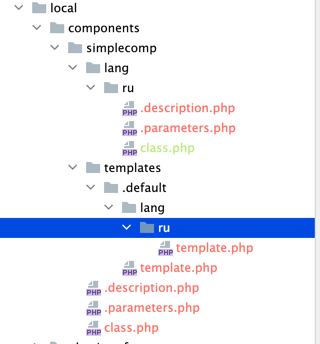

# [ex2-71] Разработать простой компонент «Каталог товаров»

*Подробное описание задачи смотреть в материалах: [примеры заданий (pdf)](../pubinfo/Ex2AllType.pdf)*

## Общие требования

* У созданного компонента задать код: simplecomp.exam, название: «Мой компонент», раздел для отображения компонента в визуальном редакторе: «Экзамен №2».
* Работу решения продемонстрировать в разделе сайта /ex2/simplecomp/, добавить пункт в главное меню «Экзамен2», и пункт в левом меню «Простой компонент».

## Решаемая задача

* Компонент должен выводить список товаров, сгруппированных по классификатору. Классификатор – элементы другого информационного блока, разделы не будут использоваться.

* Будет использоваться множественная привязка элементов к классификатору.

* В информационном блоке каталога предполагается большое количество элементов (порядок - тысячи), но при этом привязанных к внешнему классификатору – не более нескольких десятков.

## Решение

Делаем по аналогии с заданием ex2-70: [[ex2-70] Разработать простой компонент «Каталог товаров»](./ex2-70.md)

**Для ускорения процесса можно скопировать любой системный компонент Битрикс, в результате вы получите всю необходимую структуру компонента, которую потом сможете отредактировать в соответствии с условиями задания.**

1) Подготавливаем "заготовку" для компонента:   
   1.1) Берём за основу системный компонент `\bitrix\components\bitrix\photo.random\`, копируем его в `\local\components\simplecomp\ex2-71`

   1.2) Удаляем лишние файлы и папки из компонента:
  * `local/components/simplecomp/ex2-71/images`
  * `local/components/simplecomp/ex2-71/lang/en`
  * `component.php` - вместо него, мы будем использовать файл `class.php` (можно взять из `bitrix/components/bitrix/app.placement/class.php`)
  * и т.д.  
    

   1.3) Правим описание компонента `.description.php`
  * Изменяем параметры:
  * Удаляем иконку, в новых версиях компонентов они не используются - `"ICON" => "/images/photo_view.gif"`
  * Правим раздел для отображения компонента в визуальном редакторе: "ID" и "NAME"
  * `/lang/ru/.description.php`
   ```php
   <?
   if (!defined("B_PROLOG_INCLUDED") || B_PROLOG_INCLUDED !== true) {
       die();
   }
   
   $arComponentDescription = [
       "NAME"        => GetMessage("EX2_71_NAME"),
       "DESCRIPTION" => GetMessage("EX2_71_NAME"),
       "CACHE_PATH"  => "Y",
       "SORT"        => 2,
       "PATH"        => [
           "ID"   => "exam2",
           "NAME" => GetMessage("EX2_71_PATH_NAME"),
       ],
   ];  
   ```
   1.4) Правим параметры компонента - `.parameters.php`  
   * Удаляем лишнее, оставляем только `$arComponentParameters`  
   * Правим параметры:  
   * `BASE` - Базовые параметры для работы компонента  
   * `/lang/ru/.parameters.php`

   ```php
   if (!defined("B_PROLOG_INCLUDED") || B_PROLOG_INCLUDED!==true) die();
   
   $arComponentParameters = array(
	"GROUPS" => array(
	),
	"PARAMETERS" => array(
		"IBLOCK_ID_CATALOG" => array(
			"PARENT" => "BASE",
			"NAME" => GetMessage("IBLOCK_ID_CATALOG"),
			"TYPE" => "STRING",
			"DEFAULT" => '',
		),
		"IBLOCK_ID_CUSTOM_SECTION" => array(
			"PARENT" => "BASE",
            "NAME" => GetMessage("IBLOCK_ID_CUSTOM_SECTION"),
            "TYPE" => "STRING",
            "DEFAULT" => '',
        ),
        "CODE_CUSTOM_PROP" => array(
            "PARENT" => "BASE",
            "NAME" => GetMessage("CODE_CUSTOM_PROP"),
            "TYPE" => "STRING",
            "DEFAULT" => '',
        ),
        "TEMPLATE_DETAIL_URL" => CIBlockParameters::GetPathTemplateParam(
            "DETAIL",
            "TEMPLATE_DETAIL_URL",
            GetMessage("IBLOCK_DETAIL_URL"),
            "/catalog_exam/#SECTION_ID#/#ELEMENT_CODE#.php",
            "URL_TEMPLATES"
        ),
        "CACHE_TIME"  =>  Array("DEFAULT"=>180),
        "CACHE_GROUPS" => array(
            "PARENT" => "CACHE_SETTINGS",
            "NAME" => GetMessage("CP_BPR_CACHE_GROUPS"),
            "TYPE" => "CHECKBOX",
            "DEFAULT" => "Y",
        ),
    ),
    );
   ```

   1.5) `class.php`
  * Для ускорения берём готовый файл, чтобы меньше писать, например, из `/bitrix/components/bitrix/app.placement/class.php`, который в себе уже содержит все основные методы и структуру.
  * public function onPrepareComponentParams($arParams)
  * public function executeComponent()

```php
if(!defined("B_PROLOG_INCLUDED") || B_PROLOG_INCLUDED !== true)
{
	die();
}

/**
 * Bitrix vars
 *
 * @var array $arParams
 * @var array $arResult
 * @var CBitrixComponent $this
 * @global CMain $APPLICATION
 */

use Bitrix\Main\Loader;

class CAPConnectComponent extends \CBitrixComponent
{
	public function onPrepareComponentParams($arParams)
	{
        // Приводим значения к числу
        $arParams["IBLOCK_ID_CATALOG"] = intval($arParams["IBLOCK_ID_CATALOG"]);
        $arParams["IBLOCK_ID_CUSTOM_SECTION"] = intval($arParams["IBLOCK_ID_CUSTOM_SECTION"]);
		$arParams['CODE_CUSTOM_PROP'] = trim($arParams['CODE_CUSTOM_PROP']);
		$arParams['TEMPLATE_DETAIL_URL'] = trim($arParams['TEMPLATE_DETAIL_URL']);

        if(!isset($arParams["CACHE_TIME"]))
            $arParams["CACHE_TIME"] = 180;

            return parent::onPrepareComponentParams($arParams);
	}

	/**
	 * Check Required Modules
	 *
	 * @throws Exception
	 */
	protected function checkModules()
	{
		if(!Loader::includeModule('iblock')){
		    return false;
		}
		return true;
	}

    /**
     * Производим выборку
     */
    public function setArResult()
    {

    }

	public function executeComponent()
	{
        global $APPLICATION;
        global $USER;

		if(!$this->checkModules()) {
            ShowError(GetMessage("EX2_71_IB_CHECK"));
			return;
		}

        if ($this->StartResultCache()) {
            $this->setArResult();
            // Список ключей массива $arResult, которые должны кэшироваться при использовании встроенного кэширования компонентов, иначе закеширует весь массив arResult, кэш сильно разростается
            $this->setResultCacheKeys(
                [
                    "COUNT", 
                ]
            );
            $this->includeComponentTemplate();
        }
	}
}
```

2) Создаем новый ИБ. Создаём элементы.
3) Настройка ИБ:
* Добавляем новое св-во `"FIRMA"` в ИБ "Продукция"
* Задаем элементам' в ИБ `"Продукция"` привязку к нескольким фирмам
* 
3) Создаем раздел (каталог + название). Добавляем компонент на страницу. Вводим параметры.
```php
$APPLICATION->IncludeComponent(
	"simplecomp:ex2-71",
	"",
	Array(
		"CACHE_GROUPS" => "Y",
		"CACHE_TIME" => "180",
		"CACHE_TYPE" => "A",
		"CODE_CUSTOM_PROP" => "FIRMA",
		"IBLOCK_ID_CATALOG" => "2",
		"IBLOCK_ID_CUSTOM_SECTION" => "7",
		"TEMPLATE_DETAIL_URL" => "/ex2/simplecomp/ex-71/#SECTION_ID#/#ELEMENT_CODE#.php"
	)
);
```

4) Реализация логики компонента - подготавливаем arResult:  
   4.1) Выборка элементов из ИБ "Фирма" - CIBlockElement::GetList  
   4.2) Выборка товаров из ИБ "Продукция" по выбранным классификаторам "Фирма" - CIBlockElement::GetList
   4.3) Группируем
   4.4) Реализуем кеширование  
   4.5) Устанавливаем заголовок страницы    
   Код можно посмотреть перейдя по [ссылке](../../local/components/simplecomp/ex2-71/class.php)


5) Формируем вывод в шаблоне компонента  
   Код можно посмотреть перейдя по [ссылке](../../local/components/simplecomp/ex2-71/templates/.default/template.php)

## Полезные ссылки

* [Вебинар: Готовимся в экзамену №2, отложенные функции и кеширование в компонентах](https://www.youtube.com/watch?v=KC6WcgaEWt4&feature=youtu.be)
* [Дополняем SetResultCacheKeys стандартного компонента](https://dev.1c-bitrix.ru/community/webdev/user/11948/blog/5500/)
* [Описание компонента](https://dev.1c-bitrix.ru/learning/course/?COURSE_ID=43&LESSON_ID=2828)
* [Параметры компонента](https://dev.1c-bitrix.ru/learning/course/?COURSE_ID=43&LESSON_ID=2132)
* [setResultCacheKeys](https://dev.1c-bitrix.ru/api_help/main/reference/cbitrixcomponent/setresultcachekeys.php)
* [CIBlockElement::GetList](https://dev.1c-bitrix.ru/api_help/iblock/classes/ciblockelement/getlist.php)
* [CIBlockResult::SetUrlTemplates](https://dev.1c-bitrix.ru/api_help/iblock/classes/ciblockresult/seturltemplates.php)

## P.S.

* [Экзамен №2. Вопросы и ответы по заданиям](https://dev.1c-bitrix.ru/community/forums/messages/forum6/topic91539/message600825/#message600825)
    * Q: В задании прописано указать параметр - Шаблон ссылки на детальный просмотр товара, строка. Но данный параметр не используется в рамках билета ex71 опять же, он требуется в ex81. Вводить ли данный параметр?
    * A: Что сказано в задании - то и делаете.

* [Экзамен №2. Вопросы и ответы по заданиям](https://dev.1c-bitrix.ru/community/forums/messages/forum6/topic91539/message640924/#message640924)
    * Q: Здравствуйте! Вопрос по заданию [ex2-71]. В "Технические требования" прописано, компонент должен иметь параметр "Шаблон ссылки на детальный просмотр товара, строка". Но данный параметр далее по заданию нигде не используется. Параметр необходимо просто добавить без использования в логике компонента? Или здесь требуется формировать ссылку на детальный просмотр элементов, по аналогии с [ex2-81]? Поясните пожалуйста.
    * A: По заданию требуется формировать url, посмотрите еще раз описание)

____
* [Задания](tasks.md)
* [README.md](../../README.md)